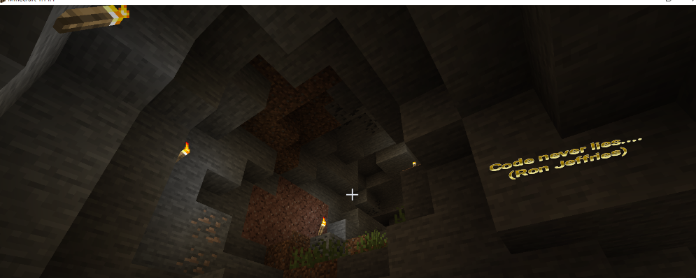
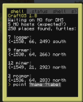
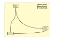
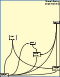
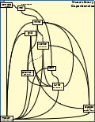
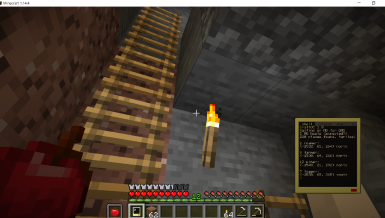
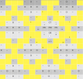
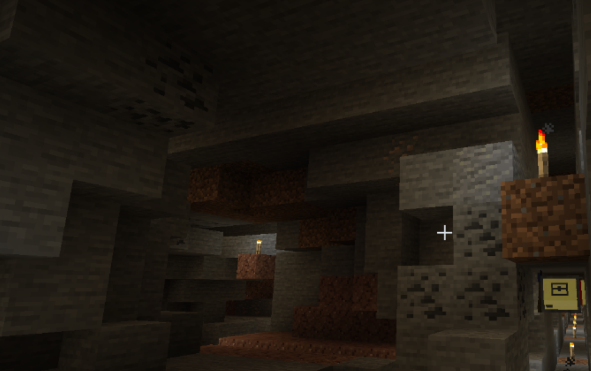

# Mining MUSE (A Moderately Useful Source Exploration)

MUSE is a collection of resources built on the <a href="https:/tweaked.cc/" target="_blank"> ComputerCraft _mod_</a> to <a href="https:/www.minecraft.net/" target="_blank"> Minecraft </a> written in <a href="http:/www.lua.org/" target="_blank"> Lua </a>. It provides a set of capabilities for ComputerCraft turtles and computers (also written in Lua) that make it easy (quite possibly too easy) to mine, farm, and do explorations in Minecraft worlds. 

Looking about in MUSE, as we'll do here, is a different kind of exploration. It is the exploration into how to develop clean, maintainable code intended for those worlds (as a start).  Avoiding a mess might not be too easy. The hope is making it easier to avoid so it's less likely to happen.

But why would you want to do that? Because, even if you're working all on your own, looking at what you wrought in fevered moments not so long past, you just know deep down that it was some visitor from another planet who wrote the tangled mess you're facing. And, of course, in the real world, code development is generally something done with others, sometimes a lot of others.

## Chapter 1 - Exploring Why, What, What Not, and How
<br/>



_Mining MUSE_ is based on the idea of exploration, Just as software development is actually practiced, there's a lot of exploration to do when trying to understand and fix or extend someone else's code (including that mess made by that alien cowboy). What follows is an overview of that exploration. But the overview is only the root of a very branchy tree. The interesting stuff is generally found somewhere near the leaves. Where exactly depends on you, your interests, your motivation, your experience. Go as deep as seems useful. Go back and look deeper when that seems right. It's up to you.  

The (HTML) <a href="#links"> links </a> to places in the branchy tree throughout MUSE are a way into the exploration. The materials in the tree describe working examples with, yes, more links, drawings, pictures, and extensively documented code. <a id="links">  </a>. There's probably as much explanatory text as executable code in the examples. This leads to the usual tension between the ideas of <a href="https:/en.wikipedia.org/wiki/Literate_programming" target="_blank"> _literate programming_ </a> and the, all too correct, understanding that <a href="https:/twitter.com/ronjeffries/status/949400218092687361?lang=en" target="_blank"> &ldquo;comments (sometimes) lie&rdquo; </a>. If you need to extensively comment code, as we do to meet our goals here, you're taking on an extra burden to keep the comments true to the code (which never lies). There is a benefit though of doing the work of extensive commenting : you're explaining the code (especially the _whys_ of the code) to a virtual partner when a real life one, quite possibly the you from another planet, is not available. 

Explore the links in the code body to go on excursions further (and further) afield. Feel free to wander, skimming as you go, and then return for deeper explorations as seems best. Early chapters will generally go into detail omitted in later ones so if you skip chapters, you may need to go back a bit to go forward.</br>

So then, here we are, looking at whether to knock about in that tree. Is it worth the time? For that, let's examine what we're trying to do. Here it is: 
<div style="background-color: white">

- **Why this?** The intent is to provide an exploration of how to write <a href="https:/www.amazon.com/Clean-Code-Handbook-Software-Craftsmanship/dp/0132350882" target="_blank"> clean code </a>expected to be read (so it can more easily be maintained) and, as as part of that maintenance, extended.

- **What is this?** A tutorial of sorts using just the code needed to implement a particular set of ComputerCraft capabilities with Lua scripting. Ease of code maintenance over the long term is the chief goal of the design of that code. MUSE is a bit strange in that it aims to be a professional piece of development for a problem domain which is, after all, just a game. The game is the bit of sugar that, hopefully, helps the medicine go down.

- **What is this not?** It does not pretend to be a <a href="https:/ocw.mit.edu/courses/electrical-engineering-and-computer-science/6-005-software-construction-spring-2016/readings/" target="_blank"> comprehensive review of software fundamentals </a>, <a href="https:/gustavus.edu/mcs/max/concrete-abstractions-annotated-toc/" target="_blank"> computer programming </a> or, the range of ideas for <a href="https:/mitpress.mit.edu/sites/default/files/sicp/index.html" target="_blank"> the design and use of computer languages </a>. (Here's a <a href="https:/news.ycombinator.com/item?id=2115756" target="_blank"> tour guide </a> you might find useful.) It's also not likely to be useful as someone's <a href="https:/turtleappstore.com/book/" target="_blank"> very first exposure </a> to just getting some code to run. There are <a href="https://www.youtube.com/watch?v=wrUHUhfCY5A" target="_blank">videos</a> and <a href="https://www.youtube.com/watch?v=DSsx4VSe-Uk" target="_blank">other</a> on-line <a href="https://www.computercraft.info/forums2/index.php?/topic/15033-computer-basics-i/" target="_blank"> resources</a> as well. (But do come back once that's behind you.) A more serious limitation is the <a href="https:/golang.org/" target="_blank"> issue of scale </a>. MUSE is not millions of lines of code created by hundreds of developers. The hope is that by exploring MUSE you will find ideas and approaches that will prove useful if you ever need to work in that necessarily more constrained environment. 

- **How is this done?** By exposing in some detail the design ideas underlying a particular body of code, namely the code for MUSE.

- **What's next?** Reading on to review the design and implementation of MUSE. 

- **And after that?** Setting up a environment allowing modification of the code base and trying it out in ComputerCraft execution. 
</div>

## Chapter 2 - Moving Turtles: Functions, State, and History 

One of the first things to think about when designing a body of code is how that body of code might be organized.  MUSE is organized around the idea of what we'll call a _module_. Each module is a file that includes at least one <a href="https:/en.wikipedia.org/wiki/Library_(computing)" target="_blank"> _library_.</a> (A module may contain additional libraries sharing some internal implementations.) In what follows we'll explore the idea of libraries, likely the most important idea in the exploration of MUSE, and show an example of how they might be organized for readers and maintainers. 

Library interfaces set the boundaries of a library.  They indicate what can be relied upon by the users of a library without needing to know about its implementation. In this way, they allow the effects of library maintenance to be contained within a library. The right organization of library structure is an important way of easing maintenance. Your first attempt might not be right. Expect penitential experiences <a href="https:/en.wikipedia.org/wiki/Code_refactoring" target="_blank"> while refactoring code </a> that was written in haste. (Code in haste, repent at leisure.) Sometimes, it's best to just step away for a bit and just think about a design (or debug) issue. Don't just do something, stand there. Really. Often a cleaner approach to the problem will emerge. If the cleaner approach solves more than one problem cleanly, it stands a good chance of being more maintainable.

As we've said, libraries have interfaces. MUSE introduces a way of describing interfaces and checking their use by adding annotations as comments to the source code. As a dynamically typed language, Lua provides flexible and expressive richness for implementation and the corresponding opportunities for run time errors that might only show up (expensively) in fielded code. Describing interfaces and checking their use is a way to deal with some of these unfortunate opportunities as part of development. <a href="https://minerbadd.github.io/CodeMark/Annotations.html#type" target="_blank"> CodeMark Annotations </a> are documented in their own right. It might be best just to scan that documentation for now to get a general sense and come back to it as needed. The descriptive text for the code we'll explore will be enough to understand each interface (although in a less concise form).

The second idea we want to think about as we begin our exploration deals with the management of <a href="https:/en.wikipedia.org/wiki/State_(computer_science)" target="_blank"> _state_ </a>. The most common ways to design code involve the concept of state, elements with values that are changed <a href="http:/lua-users.org/wiki/ImmutableObjects" target="_blank"> (_mutated_) </a> during code execution. Mismanagement of state, especially inappropriate exposure of state, is often the root problem for a lot of code that is difficult to maintain. A radical approach to the problem of state is to do without it. There are <a href="https://en.wikipedia.org/wiki/Purely_functional_programming" target = "_blank"> purely functional languages </a> that go there. Lua doesn't.

However, Lua does support approaches that limit the exposure of state. A relevant characteristic of Lua is the role functions play in the language. The third idea we'll explore is some of the ways Lua functions can be used to structure code cleanly to manage state and more. (This idea is not at all limited to Lua. Lua is just one example of a language where functions play such an important part in code structure.)

There's a lot of design power in an approach that exploits functions as just another type in a language. There's a lot of maintainance power in basing a design on tables of functions and other controls to actually do the work to be done as the code evolves. There's also a lot of unavoidable complexity in dealing with error conditions that crop up even in the relatively friendly environment of a game. All this is to say (as we've said) that the implementations we'll look at are not what you'd expect as the very first exposure to just getting some code to run.

With that understanding, it's time to climb about in that tree we spoke of. Try clicking the following link to explore the implementation of the <a href="code/lib/motion.html" target="_blank"> `lib/motion` </a> module. Then look at <a href="code/lib/places.html" target="_blank"> `lib/places` </a>,  its companion. <a href="code/lib/motion.html" target="_blank"> </a>Explore the structure of the libraries in these modules, the issues they raise in dealing cleanly with state, and check out some ways to use Lua functions to structure code. The exported interfaces for <a href="docs/lib/motion.html" target="_blank"> `lib/motion` </a>, and <a href="docs/lib/places.html" target="_blank"> `lib/places` </a> might help you to see where you've been climbing. (Just to start out, it might be better to just scan summaries for now. They'll mean more to you after spending some time on implementations.)

These libraries rely on `lib/core`, a collection, as you might expect, of generally useful (core) functions. Look at the exported interfaces for <a href="docs/lib/core.html" target="_blank"> that library </a>. We'll discuss the implementations of these functions as needed.

When that's done come back here to explore how to establish state that persists across <a href="https:/en.wikipedia.org/wiki/Session_(computer_science)" target="_blank"> _sessions,_ </a> how to deal with state distributed over a network, how error handling works in network environments, and how to build a simple and easily maintainable command line user interface.
<br/>
<a id="Chapter3"></a>
## Chapter 3 - Places: Persistence, Distributed State, Remote Errors, CLI  
This chapter is less about how to write code in general. We've just got finished thrashing that particular horse quite well enough. This chapter (and pretty much all that follow) is more about <a href="https:/en.wikipedia.org/wiki/Command-line_interface" target="_blank">  </a> how to provide some important mechanisms you may need to design (or understand how someone else did). It also deals with how to design user control through a <a href="https:/en.wikipedia.org/wiki/Command-line_interface" target="_blank">  _Command Line Interface_  </a>(CLI). 

MUSE needs to deal with networked computers (like turtles and pocket computers) operating on distributed persistent state. The operations may throw errors. We'll discuss in a bit how to deal with them. 

The persistent state is stored in <a href="https:/en.wikipedia.org/wiki/Non-volatile_memory" target="_blank"> _non-volatile memory_  </a> represented in ComputerCraft as disk storage local to each turtle and the player's pocket computer. <a id="persistence"></a>Most commonly, such persistence requires that the mutable (changeable) elements in computer memory be <a href="https:/en.wikipedia.org/wiki/Serialization" target="_blank"> _serialized_  </a>, that is turned into <a href="https:/www.lua.org/pil/2.4.html" target="_blank"> _strings_ </a> that can later be deserialized in order to store the serialized elements back into computer memory for operations on them there. 

Supporting networked distributed state is done using these same `lib/core` <a href="code/lib/core.html#serialize" target="_blank"> MUSE serialization facilities </a> to send strings over the network. These strings are then deserialized when they are received by the turtle's or player's pocket computer. 

The chapter also deals with remote error handling. Errors <a href="https:/en.wikipedia.org/wiki/Exception_handling#Exception_support_in_programming_languages" target="_blank"> thrown </a> by remote operations on remote computers need to be caught on those computers and dealt with so that the remote computers remain available to handle future commands. Error information then needs to be passed back over the network to let the remote caller know what blew up and figure out what to do about it.

In-game, all of the simulated computers including those for turtles and players are, of course, supported by one real computer running the game. This is mostly transparent to MUSE except for the need to yield control from one of these simulated computers to the real one from time to time so other simulated computers get their turn. Turtles and other in-game computers then need to re-acquire control to handle what's been happening to them.

Lua provides and ComputerCraft uses <a href="https:/en.wikipedia.org/wiki/Coroutine#:~:text=Coroutines%20are%20computer%20program%20components,iterators%2C%20infinite%20lists%20and%20pipes." target="_blank"> _coroutines_ </a> for <a href="https:/en.wikipedia.org/wiki/Cooperative_multitasking" target="_blank"> _cooperative multitasking_ </a>. MUSE programs yield control implicitly whenever there is a turtle movement or when waiting for a network event. They yield control explicitly through ComputerCraft `os.sleep` calls. Yielding control either implicitly or explicitly allows, for example, network operations and <a href="http:/www.computercraft.info/forums2/index.php?/topic/3088-how-to-guide-gps-global-position-system/" target="_blank"> GPS </a> calculations by other simulated computers to proceed. MUSE handles   network operation events using ComputerCraft's  <a href="https:/tweaked.cc/module/parallel.html" target="_blank"> `parallel.waitForAny` </a> function. More elaborate use of coroutines <a href="http:/www.computercraft.info/forums2/index.php?/topic/25670-bbs-guide-to-coroutines/" target="_blank"> might have been considered </a>. MUSE keeps it simple.

Cooperative multitasking is a simple model that works as long as the multitasking is actually cooperative. Control is relinquished to allow other operations to proceed in a timely way but only when it's not a problem to do so, that is as long as  <a href="https:/en.wikipedia.org/wiki/Data_consistency" target="_blank"> _data consistency_  </a> is preserved. 

Here's an example: a network message is received, data structures de-serialized, associated changes made in other data structures, and then, perhaps, serialized and stored. All, really _completely_ all, of this needs to accomplished by a cooperating (simulated) computer when it has control or none of this. Doing just part leaves inconsistent state laying around to make trouble at some later time when it's really hard to figure out what went wrong.

In MUSE there is no shared mutable state between computers. It takes a network operation (applied all or none as above) to change state in another simulated computer. There's no need for the complexity of <a href="https:/en.wikipedia.org/wiki/Critical_section" target="_blank"> _critical sections_ </a> and the associated opportunities for error. There are, indeed, well developed <a href="https:/clojure.org/about/concurrent_programming" target="_blank"> _language models for concurrency_</a> to handle concurrency in a maintainable way. But if you can meet your design goals, your work will be simpler and more maintainable if you restrict the need to go there.

In MUSE, all the simulated computers do share a ROM image but this is, by definition, immutable, read only within a session. (ComputerCraft makes no guarantees about what happens if there's an out-of-game change of ROM during a session.)

If there's one design idea for maintainable code in all the above, it's to seek to keep it simple. Design goals for a project may not allow the simple approach just described for run time organization. There might be tools to mitigate risks inherent in more complicated organizations. They might work. But perhaps you can find a way to isolate complexity in the design so that most of what is developed can rely on simple assumptions about what happens at run time.

<a href="drawings/03Foundations.pdf" target="_blank"> 

<a href="code/lib/map.html" target="_blank"></a>

A design handling persistence, management of distributed state, and remote error handling is demonstrated by the <a href="code/lib/map.html" target="_blank"> implementation </a> and the <a href="docs/lib/map.html" target="_blank"> interface </a> of the `lib/map` library . The library is built on the <a href="code/lib/motion.html" target="_blank"> `lib/motion` </a> and <a href="code/lib/places.html" target="_blank"> `lib/places` </a> libraries we've already looked at. Here's the <a href="docs/lib/motion.html" target="_blank"> interface </a> for `lib/motion`, the <a href="docs/lib/places.html" target="_blank"> interface </a> for `lib/places`, and a <a href="drawings/03Foundations.pdf" target="_blank"> drawing </a> showing how these libraries form the foundation for MUSE. We'll add more libraries to this drawing as we continue our explorations.

There's an operation in `lib/map` that needs noting. It's there for a reason we'll get to later. However it needs saying now that the `chart` operation is one of those things your parents might have warned you about. (I suppose it depends on the parents.) It's almost a cartoon for a big, gaping, really scary security hole. Invoking it loads and executes a file in the `charts` directory. Which could do anything that a ComputerCraft computer could do. Now, to be sure, here be no nuclear reactors. More to the point, as someone creating the code for these computers, you've already been empowered to do anything with a ComputerCraft computer that it can do. Nonetheless, if you're tempted to do what I did and do it in the real world, rather than what I said you shouldn't, think again. It might be appropriate. Or not.

With parental warnings duly noted (and  forgotten), let's press on for a chance to look at the `lib/map` implementation of a CLI to see (if you haven't yet) how the <a href="code/lib/map.html#ops" target="_blank"> `lib/map` library </a> builds a command line interface for user control on top of the library. As usual, the implementation builds going forward to its conclusion. Reading from the end of the file toward the beginning shows how stuff happens. You can do that or start at the beginning of `lib/map` <a href="code/lib/map.html" target="_blank"> here</a>.

In the next chapter there'll be more about constructing CLIs as well as ideas about what to expose and what to hide in a design.
<br/>
<a id="Chapter4"></a> 
## Chapter 4 - Choosing Abstractions, Thin Command Implementations
<a href="https:/en.wikipedia.org/wiki/Information_hiding#:~:text=In%20computer%20science%2C%20information%20hiding,the%20design%20decision%20is%20changed." target="_blank"> _Information hiding_  </a>is an important part of what a library does. The choice of what to expose as an interface is the choice of what to hide. One aspect of choosing what (detail) to hide is choosing what abstractions to create. Exposing the wrong detail gets in the way of delivering a maintainable system. Thus, the task of design is often about exposing the right abstractions. 

For MUSE, some abstractions are obvious. They closely relate to what's in the game, our _problem domain_, and have fairly intuitive expression in the _solution domain_ that we're <a href="https:/shahworld.wordpress.com/2015/09/22/what-is-problem-domain-and-solution-domain/" target="_blank"> building</a>. For changes in the position and orientation of a turtle, the right abstractions might expose interfaces for movement in the four cardinal directions ("north", "south", "east", and "west") rather than relative directions ("right" and "left") and "forward". The <a href="docs/lib/motion.html" target="_blank"> `lib/motion` library </a> exposes these abstractions for movement. 

</a>

The `lib/turtle` library extends this abstraction consistently with the other interesting things turtles can be made to do. The consistency itself helps in maintenance. ComputerCraft's primitives deal with turns "right" and "left". They deal separately with those other things turtles can do in terms of "forward", "up", and "down".  A useful set of abstractions would be to hide all this detail and expose turtle interfaces uniformly in terms of six directions: the four cardinal and the two vertical directions. <a href="code/lib/turtle.html" target="_blank">  Look at the `lib/turtle` <a href="code/lib/turtle.html" target="_blank"> implementation </a> to see how to have yet more fun with functions.

Another detail needing abstracting is the notion what's in which `slot` of a turtle's  <a href="code/lib/turtle.html#inventory" target="_blank"> inventory </a>. What's where exactly is something worth hiding. What we generally just want to know is whether the turtle's `inventory` includes certain items. Or better, whether it includes certain kinds, `categories`, of items.  These might be, for example,  `fuels`, `stones`, or `ores`. A category could be items useful as `fills` or the kinds of `dirt`. We might be more interested in the total fuel energy available to a turtle rather than any specific kind of fuel.

Finally, `lib/turtle` also abstracts <a href="code/lib/turtle.html#unblock" target="_blank"> dealing with some of the difficulties </a>turtles face when attempting to move to a position. Hiding the detail of dealing with obstacles presents a simpler notion of movement. 

<a id="UI"></a>
Another issue for maintainable code is managing the inevitable and ongoing changes to the user interface. MUSE keeps the actual UI code "thin". We'll look at how.

 _(We have it a bit easier since the user interface for MUSE is just a <a href="https:/en.wikipedia.org/wiki/Command-line_interface" target="_blank"> command line interface, CLI</a>. The commands are simple text inputs to the <a href="https:/www.computercraft.info/wiki/CraftOS" target="_blank"> CraftOS</a> command line. The design issues for a <a href="https:/en.wikipedia.org/wiki/Graphical_user_interface" target="_blank"> graphical user interface, a GUI</a> are the subject of a whole other exploration.)_

A desire to ease testing is a second motivation for minimizing the work of the command itself, keeping it thin.  It's easier to test function interfaces than creating testing facilities that drive simulated user interactions. Because of this, almost all of the work of providing MUSE CLIs is done by libraries supporting the commands. More elaborate command interfaces (including GUIs) would require more elaborate testing support systems. Sometimes project goals demand such interfaces. They would be distractions for MUSE.

<a href="code/lib/roam.html#op" target="_blank">  </a>The <a href="code/lib/roam.html#op" target="_blank"> `lib/roam` library </a> provides an example of how to use a CLI dispatch mechanism to keep command code thin. To explore this library, keep in mind that Lua has a <a href="https:/www.lua.org/doc/sblp2005.pdf" target="_blank"> one pass compiler </a>. Functions build on each other from the beginning of the file to the end. The tree links to the end of the file. You might want to follow the code backward toward the beginning of the file through the support for <a href="code/lib/roam.html#go" target="_blank"> `go` </a> and <a href="code/lib/roam.html#to" target="_blank"> `to` </a> and then look at <a href="code/lib/roam.html#come" target="_blank"> `come` </a> to see how this is done. 
</br></br>
<a id="task"/>
<a href="drawings/04Abstractions.pdf" target="_blank"></a>
The abstractions we've been going on (and on) about are foundational in building the <a href="code/lib/task.html" target="_blank"> `lib/task` library </a> supporting a (remote) CLI for  low level turtle tasks. A similar pattern as described for `lib/roam` is used for the implementation of this CLL (CLI support library). There's little need to dig into `lib/task` unless to see another example of how thin CLI support might be built. But follow the link above if you're interested.

If all you're looking for right now is how these libraries fit into the overall design, here are links to the interfaces for <a href="docs/lib/turtle.html" target="_blank"> `lib/turtle` </a>,  <a href="docs/lib/task.html" target="_blank"> `lib/task` </a>, and <a href="docs/lib/roam.html" target="_blank">`lib/roam`</a>.  Working on code this way is a good strategy to have available to you. Often in coming to grips with a body of code written by that visitor from another planet, just understanding the library interfaces for what's been exhumed can be helpful.

 Additionally, there's a <a href="drawings/04Abstractions.pdf" target="_blank"> drawing</a>, the same one as above, showing how these MUSE libraries work together with what's gone before. Together they form and make use of  increasing levels of abstraction for MUSE.

As we'll see in the next chapter the (effectively) remote CLI is provided through a <a href="https:/en.wikipedia.org/wiki/Remote_procedure_call" target="_blank">  _remote procedure call_  </a> (RPC) that uses the local CLI dispatch we've just been exploring to command remote computers over the network. 
<br/>
<a id="Chapter5"></a>
## Chapter 5 - Remote Procedure Calls,  Distributed Service Discovery, Remote CLIs
This chapter looks at systems with distributed operations on distributed state. The principle mechanisms considered are distributed name servers to discover providers of available services and remote procedure calls (RPCs) to make use of those services.

An RPC in a <a href="https:/en.wikipedia.org/wiki/Client%E2%80%93server_model" target="_blank"> _client-server model_  </a> lets (ahem) clients get services from, well, servers. For MUSE, the client is generally the player's pocket computer. The servers are turtles with specific roles that farm, mine, or log  in an area of a Minecraft world at the command of the client.  The roles are established by ComputerCraft computer labels in an area: `farmer`, `miner`, and `logger`. 

The `rover` is a general purpose worker acting as something like the squire of the `player` going wherever the player goes. The other turtles, specialized `landed` workers, stay in the place they work, a `site`. The `player` may establish another ` site` with another set of landed workers. The worker turtles are equipped with tools appropriate to their role. 

RPCs are directed to turtles as specified by their role. ComputerCraft, of course, has no notion of roles: all it knows are computer IDs (numbers) and computer labels (strings). Its networking is tied to numbers, sequentially assigned as computers are brought into the game. If MUSE operations were based on these numbers, they would be subject to a dependency that's unwieldy to manage and therefore fragile in practice. (Stuff would break.) We need names for the computers in our network that have roles. 

As we've said, roles are tied to labels. What's left for us is to find a way to discover which names are associated with which numbers. This could be done by a task done whenever a player brings a new computer into the game. There could be a table associating names and numbers updated by such a task and kept consistent (and persistent) for all computers. We've already seen with `lib/places` how keeping names for new things (like `places`) consistent and persistent throughout the network might be done. Systems have been built this way. MUSE assumes a single player. Nothing happens to turtles "in the meantime" without that player having directed it to happen so, strictly speaking, this approach, based on consistent and persistent mappings could work. (Turtles are really hard for hostile mobs to destroy.)

Because it's useful to consider, MUSE implements a a different approach that does not count on managing distributed persistent mappings. Associations between names (roles at a site) and numbers (computer IDs) are discovered by a distributed name discovery service during system startup to reflect the state of the system however it's been changed. 

Name servers come in different flavors with different capabilities. The MUSE distributed discovery service (DDS) is only a distant cousin of one real world system, the <a href="https:/en.wikipedia.org/wiki/Domain_Name_System" target="_blank"> Domain Name System (DNS) </a>. DNS also basically associates names with numbers. But it deals with millions of computers managed with the barest minimum of coordination over the entire world. Our little DDS does not begin to consider such scale or distribution of control. However it does model approaches to the sort of <a href="https:/en.wikipedia.org/wiki/Service_discovery" target="_blank"> service discovery </a> provided for small scale home or local office networks.

Given a way to associate names wth numbers, we have a way to get a service request from a client to a server. The other part of what's needed is a way to actually provide the service. That's a job for Remote Procedure Call, an action hero you may (or may not) have heard of. The design of the MUSE RPC makes use of MUSE <a href="code/lib/core.html#serialize" target="_blank"> serialization </a> and Lua's `load` facilities to package and unpackage procedure arguments for network transmission and reception. As a development exercise, this could be generalized to use language independent formatting such as <a href="https:/en.wikipedia.org/wiki/JSON" target="_blank"> JSON </a>. There are a number of such <a href="https:/www.google.com/search?q=json+lua" target="_blank"> implementations</a>.  

But that seemed to be a distraction from our goals. Even so, supporting our goals, the design is more general than is strictly needed. As we'll see, it is built to handle environments that could be bothered by unfriendly, rogue actors. This is not MUSE but it seemed useful to explore. 

It is also designed to be testable outside its intended deployment. This kind of design certainly _is_ relevant to MUSE and might be important in more than just the MUSE environment. In addition to the debugging benefit, working in a development sandbox means that getting errors when trying stuff has limited consequences.

<a href="drawings/05RemoteProcedures.pdf" target="_blank">
</a>

The <a href="docs/lib/remote.html" target="_blank"> `lib/remote`</a>, <a href="docs/lib/dds.html" target="_blank"> `lib/dds`</a>, and <a href="docs/lib/net.html" target="_blank"> `lib/net` </a> libraries provide the interfaces for the facilities we've been discussing. The drawing shows <a href="drawings/05RemoteProcedures.pdf" target="_blank"> how they fit </a> in the overall context of MUSE. 

<a href="code/lib/remote.html" target="_blank">
</a>

Look first at <a href="code/lib/remote.html" target="_blank"> `lib/remote` </a> to see how RPCs work. Review of its code will lead into excursions of <a href="code/lib/dds.html" target="_blank"> `lib/dds` </a> and more. Then look at how <a href="code/lib/net.html" target="_blank"> `lib/net` </a>  actually creates (and documents) the remote CLI we said this chapter would discuss. The generated documentation for the remote CLI is <a href="docs/lib/net.html" target="_blank">here</a>. The information in `lib/remote` (kept close to the implementation) was all that was needed to generate it.

This all works given that roles and a site to work have been established to start with. MUSE turtles and the player's pocket computer are assigned roles at their site (as ComputerCraft computer labels). This is done by running <a href="code/programs.join.html" target="_blank"> `join`</a> which calls <a href="code/lib.dds.html#join" target="_blank"> `dds.join`</a>.

Finally, while most of the remote CLI commands are prefaced by a role (`farmer`, `miner`, `logger`, or `rover`) to target a given turtle, as a convenience some commands assume a role (and so, a target). For the `rover`, these are <a href="code/programs/come.html" target="_blank"> `come` </a> and <a href="code/programs/tail.html" target="_blank"> `tail` </a>. You may have looked at their implementations in <a href="code/lib/roam.html#come" target="_blank"> `lib/roam`</a>. There's another part of their implementation in <a href="code/lib/remote.html#come" target="_blank"> `lib/remote`</a>.

A CLI command prefaced by a role needs a dispatch to the `lib/remote` handler for that command. As you've likely come to expect, there's not much to these. They're boringly (and helpfully) similar: <a href="code/programs/farmer.html" target="_blank"> `farmer`</a>, <a href="code/programs/miner.html" target="_blank"> `miner`</a>, <a href="code/programs/logger.html" target="_blank"> `logger`</a>, <a href="code/programs/roamer.html" target="_blank"> `roamer`</a> and <a href="code/programs/porter.html" target="_blank"> `porter`</a>. 

_(We'll talk about the `porter` in just a bit.  While, for generality, it's possible to send the `porter` a CLI command prefaced by its role, actually only a very few of them are useful. It's not a turtle.)_

Astonishingly it's taken us till now to build up MUSE capability to the point where it would be useful to actually explore operating MUSE in the Minecraft/Computercraft environment. If it seems good for you to do that now, here's a link to guide you through the needed  <a href="#appendix-musecraft---running-muse" target="_blank"> `setup`</a>. 

To help with this, a library, <a href="code/lib/exec.html" target="_blank"> `lib/exec`</a> provides support for setting up MUSE operation with a pocket computer and turtles. It uses a `command computer` (I know, I know. We've taken cheating to a whole new level.). The command computer is a MUSE `porter`. There's just one of them in the MUSE environment. The <a href="code/lib/exec.html" target="_blank"> `lib/exec`</a> library makes it easier to do ComputerCraft GPS deployment with <a href="code/lib/gps.html" target="_blank"> `lib/gps` </a> by aligning Minecraft coordinates with turtle dead reckoning. 

<a href="drawings/05CommandIntegration.pdf" target="_blank">
</a>

Since we've gone ahead and used a command computer, we've already demonstrated a shameful lack of constraint. As another indulgence, a library, <a href="../lib/port.html" target="_blank"> lib/port </a>, provides an integration with `lib/map places` and the Minecraft `teleport` command. The   <a href="drawings/05CommandIntegration.pdf" target="_blank"> drawing </a> adds them into the overall context of MUSE. 

In the following chapter we'll look at the MUSE libraries that create and make use of what you might think of as a (very simple) <a href="https:/en.wikipedia.org/wiki/Declarative_programming" target="_blank"> declarative language </a>. They allow us to describe turtle operations by _what_ is to be done rather than _how_ it is to be done. In some ways, it's another kind of abstraction with the goal of increased maintainability: hiding the detail of _how_ while exposing the main point: _what_.

<a id="Chapter6"></a>
## Chapter 6 - Planners and Workers, Declarative Programming

In this chapter, as threatened, we'll explore the idea of <a href="https:/en.wikipedia.org/wiki/Declarative_programming" target="_blank"> declarative programming </a>. We'll look at using this approach for digging shafts and tunnels to mine ores.  The _what_ of all this will get pretty detailed. In some sense, that's the point. The luxury of just saying _what_ is particularly important when there's a lot of detail (that inevitably will get changed). 

As is typical, there's two parts to this declarative programming engine: a <a href="code/lib/planner.html" target="_blank"> `planner`</a>  (a generator of an executable interpretation of the _what_) and a <a href= "code/lib/worker.html" target="_blank"> `worker`</a>  (providing that execution). 

<a href="drawings/06Declarations.pdf" target="_blank"></a>As a guide, here's how the libraries we'll be looking at <a href="drawings/06Declarations.pdf" target="_blank"> fit together </a>. (For clarity, the drawing just shows these libraries and their dependencies.) There's an extension, `grid`, for providing work functions for mining plans. (We'll explain work functions and examine `lib.grid` in a bit.) The `mine` library passes those extended plans to the `worker` library to support the `mine` CLI . As you might figure, there's a lot of <a href="https:/en.wikipedia.org/wiki/Decomposition_(computer_science)" target="_blank"> factoring </a> (that is, which piece does what)
to explore in the design.  But before we explore these factored libraries, it'll be helpful to see something about what they might be useful for.

Apologies in advance: this chapter will be unavoidably detailed in the _what_ in order to ground our exploration.

The _what_ that is to done for our examples is to dig some holes. In particular, shafts down to a given level and tunnels to mine at that level. However, digging is only part of the work. Provisioning a shaft needs, for example, ladders, torches, and storage barrels put just right. For the player's safety, we also need platforms to stand on. 

Let's start looking at where we want to end up. So that we stay within blocks that Minecraft has <a href="https:/minecraft.gamepedia.com/Chunk" target="_blank"> loaded </a>, we want to dig (mostly) down rather than out. Straight down has its own preferably avoidable excitements so we want to dig in a pattern that snakes back and forth digging 

- **down and east** (say), then **down and west** (say) to get to a given (odd numbered) level 
- and then dig in a complementary pattern of 
- **down and west**, then **down and east** to get down to the next (even numbered) level. 

The even-odd pattern repeats for as far down as we want to dig.

Here are some pictures of what that looks like. First the ladder that got us down to the odd level:


Next looking east across the platform at that level to the ladder that goes down to the next (even) level:
<br/>


The ladder on the left of this picture is the same one we saw above. Next, imagining we've gone down that ladder to the even level, looking back up the ladder we took going down looks like the next picture.    


Looking west at that level across the platform looks like the picture below. 

As you look across the platform you can see the ladder down to the next (odd numbered) layer. If we went down that ladder to the (odd numbered) level just below, it would look like the first picture in this series. Good news: we have a repeating pattern to code to. 

<br/>
 
<br/><br/><br/><br/>

Note the torches placed on blocks of dirt. It's easy for players to get lost in these tunnels. The torches placed on dirt blocks are anomalous in mines. By their oddity, they stand out. Helpfully, they indicate the way back to the shaft along what we've called the _inner_ tunnels.
 
Follow the link to see a <a href="drawings/06SnakeShaft.pdf" target="_blank"> schematic representation </a> of what's going on in these pictures. It shows the _what_ for the work to be done, the repeating pattern shown schematically. The schematic tells a fairly complicated story: 
<a href="drawings/06SnakeShaft.pdf" target="_blank"> 
 </a>

- how the turtle is to **move up and down** between levels in "the plane of motion", 
- where the **ladders and torches** are to be put north of that plane, 
- where fill is to be put to form a **platform for the player**, and, finally, 
- where the **`marker` and  turtle's `post`** is in the shaft at each level.
<br/>

We'll use (the numbered) markers to navigate the twists and turns of the mine to get to a `post`. A `post` is a place that the mining turtle goes to between operations. Each `marker` is simply a `point` as we described when discussing `lib/places`. It has a particularly structured name and label to make mine navigation work. 

All this detail motivates a declarative _what_ rather than imperative _how_ approach to writing maintainable code. It's likely obvious that getting all this right the first time isn't very likely. There will be changes. It's easier to make those changes if we can find a declarative representation that pretty much directly follows our schematic (and its changes) as understanding develops of what must be done.

In MUSE, the _what_ is a `plan`. The `lib/planner` library uses Lua to load a `plan` and create its internal representation. This representation is consumed by `lib/worker`. It's a different kind of dependency. Together these libraries are the procedural engine for the _how_ that supports the declarative _what_. They take care of the _how_ so you don't have to. 

The design of the declarative `plan` "language" is governed by a few principles. We want to: <a id="plan"> </a>

- **limit the declarative scope** to moving turtles, placing items, and marking places; _and  beyond that scope_, 
- **extend operations with Lua (work) functions** rather than making a bigger language; _and_
- **fit well with Lua syntax** to minimize the work (and opportunity for error) in parsing the representation.

The general idea is to keep it simple and use Lua for the hard stuff. Making the language bigger than it strictly needs to be means there's more (parsing) to get wrong and, just as importantly, more that's unfamiliar. (That's a potential pitfall for <a href="http:/staff.um.edu.mt/afra1/seminar/little-languages.pdf" target="_blank"> _little languages_</a>.) One of the strong points for Lua is the coherence between development and operation: Lua _**is**_ the <a href="https:/en.wikipedia.org/wiki/Shell_script" target="_blank"> _shell language_ </a> as well as the general development language. In keeping with this idea, a MUSE plan is just a Lua file. It's easy to escape back to Lua whenever there's the temptation to make the little language a little bigger.

<a href="drawings/06Declarations.pdf" target="_blank"></a>We make use of this facility in the plan for mining ores. There's a lot of _how_ that would be needed for any plan for mining in a `grid` pattern. That's captured in the `lib/grid` library. The _what_ plan for one particular mine geometry, `plans.cross`, references `lib/grid` for the _how_ that will be directly handled  by Lua fuctions. Our little language expects to <a href="code/lib/motion.html#moving" target="_blank"> _step_</a> turtle motion in a closure as we discussed way back when we explored `lib/motion`. At each of these steps, the _what_ operations specified within the declarative scope of our little language are executed and then an optional (Lua) _work function_ is invoked. This escape to <a href="https:/en.wikipedia.org/wiki/Procedural_programming" target="_blank"> procedural programming</a> keeps the little language little.

<a href="code/lib/planner.html" target="_blank"></a> Look at the <a href="code/lib/planner.html" target="_blank"> `lib/planner`</a> introduction to see the definition of our little language. Then explore the <a href="code/plans/snake.html" target="_blank"> `plan`</a> for a `snake` shaped shaft like the one we've been looking at in those pictures to see how the language is used. Finally follow the link in the tree back to <a href="code/lib/planner.html" target="_blank"> `lib/planner`</a> to see how it produces an internal representation for the plan that is used by `lib/worker`. 

You can explore the <a href="code/lib/worker.html#operate" target="_blank"> `worker.execute`</a> function and follow the text there backward through the library. (As we've mentioned earlier, given Lua's one pass compiler, it's often useful to read Lua files from the end to the beginning after looking at either the file's introduction or an available summary.) As you'll see, the only tricky bit in the code, an admittedly tricky <a href=" https:/en.wikipedia.org/wiki/Mutual_recursion#:~:text=In%20mathematics%20and%20computer%20science,in%20terms%20of%20each%20other" target="_blank"> mutual recursion</a>, is the code handling (and potentially recovering from) the things that make life tricky for turtles: getting blocked, getting lost, and running out of fuel.

For reference, here are the summaries for these files: for the <a href="docs/plans/snake.html" target="_blank"> shaft plan</a>, for the <a href="docs/lib/planner.html" target="_blank">  planner </a>, and for the <a href="docs/lib/worker.html" target="_blank">  worker</a>.

The `plan` for mine shafts get us down to a given level for mining ore (and back again). Tunnels need to be bored at a level to find and dig ore at that level. To minimize fuel consumption, all the digging at a given position is done while the turtle is at that position. This results in a cross shaped pattern for tunnels. Here's what that looks like at an even numbered level looking south-west:


As you can see in the image above, the tunnel running north provides access to the east-west tunnels where the digging for ore is done. A given for Minecraft (or so we're told) is that ore is never found in smaller than 2 by 2 block veins. We can use that assumption to reduce the amount of digging necessary to find ore. <a href="drawings/06CrossSection.pdf" target="_blank">  </a>. With this in mind, we can follow the link to  look at an <a href="drawings/06CrossSection.pdf" target="_blank"> excavation pattern</a> that is repeated every four blocks vertically and every six blocks horizontally. (For tunnels as well as shafts, a schematic representation of what is to be done is helpful, perhaps even necessary.) The schematic representation in this case is a cross section looking north, showing how tunnels are to be dug to find ore. The blocks labeled "`O`" are dug in the cross shaped pattern we spoke of earlier. The blocks labeled "`--`" are adjacent to dug blocks and therefore may be inspected as we dig.  
 
One of the repeated patterns is shown with more detail. In that pattern, the dug blocks are labeled "`CT`" (cut top), "`CB`" (cut bottom), "`CN`" (cut north), "`CS`" (cut south), and "`CM`" (cut middle). The inspectable blocks are labeled "`--`" and in the detail they are also numbered. If ore is found in a given numbered block, there may be ore in the 2 x 2 section whose far corner is labelled with that number. We'll dig out that 2 x 2 section. In doing this, we won't dig out any of the other "`--`" blocks since by doing that we would not be able to see if they showed indications of ore in the 2 x 2 veins they were part of. (Yes, it took a number of failed attempts to get this right. Burying this _what_ in a bunch of _how_ would have been a likely unmaintainable mess.)

Finally, we need torches in these tunnels. They are in put the bottom of the cross shaped dig and replaced after any excavation. The plan needs to work even when tunnels run into caves (as shown).



<a href="code/plans/cross.html" target="_blank"></a>Follow the link in the tree to look at the <a href="code/plans/cross.html" target="_blank"> plan</a> for digging, mining, and navigating tunnels together with the <a href="drawings/06CrossSection.pdf" target="_blank"> cross section drawing</a> to see how the plan follows from the drawing.  The summary of the plan is <a href="docs/plans/cross.html" target="_blank"> here</a>. 

Note that the tunnels in a `cross` plan form a (rectangular) `grid`. As we mentioned before, the `cross` plan references `lib/grid` so that the plan itself keeps to the _what_. There's an awful lot of _how_ in mining. That's kept out of the plan and the _little language_ is kept little. There's a library for that: <a href="code/lib/grid.html" target="_blank">`lib/grid`</a>. As you'll see if you follow the link, it does a lot.

The CLI for mining is `lib/mine`. Here's its <a href="docs/lib/mine.html" target="_blank"> summary</a>. The <a href="code/lib/mine.html#mine" target="_blank"> implementation </a> is straight forward (and frankly kinda ugly) with a lot of status monitoring and error checking as it loads and runs plans. If you must look, it might be best studied working from the end of the file to the beginning.

The next chapter takes the declarative idea to another level. Sometimes rather than defining the `path` of a `plan` explicitly, it's useful to let MUSE generate a plan by just specifying the three dimensional rectangular `bounds` that its `path` should cover. In this case, the support libraries do more so that the client declarations can do less. Because of this, the support libraries wind up being more intertwined with their clients. In particular, control flow passes back and forth between libraries and clients in what might be characterized as a <a href="https:/en.wikipedia.org/wiki/Inversion_of_control" target="_blank"> _framework inversion of control_ </a>. Before considering the idea of frameworks, we always saw clients calling libraries. The new and surprising thing here is that the library is also calling its clients.
<br/>
## Chapter 7 -  Frameworks and Factoring 
<br/>


The MUSE framework built around `lib/field` supports work on a `field` as defined by a three dimensional rectangular `bounds`. Each of the files in the `fields` directory is, as you might guess, a _field file_. They include declarative representations of what is to be done in their `field`. One idea they have in common is the idea of a `plot`. Primarily to deal with the limitations of turtle inventory, plots break the field into pieces that can be dealt with separately. Another thing they have in common is participation in a control framework orchestrated by `lib/field`.

As we'll see, there is a complicated flow of control split between `lib/field` and its clients. This complexity opens up many unfortunate opportunities for <a href="https:/en.wikipedia.org/wiki/Software_rot" target="_blank"> _bit rot_</a>. So whether to create a framework is a design decision to consider carefully. Sometimes though, it's the right way. 

For MUSE, the hoped  for compensating benefit from this complicated flow of control is the ability to use the framework to readily define the _what_ for the work to be done on a wide variety of `fields` because the framework:

- leaves the three dimensional `bounds` geometry of plots in the control of the field
- while generating an fuel efficient `path` through all the blocks in that geometry;
- supporting whatever suite of operations is established by a set of _field files_; and
- allowing specification of any `plan` to do the work for the `field` along the `path`.

It's not like what we saw in `lib/mine` which knew (in grim detail) all about going down shafts and back up shafts to get to bores which could be used to mine ores. Here `lib/field` doesn't presume much at all about what's to be done in a `field`. It's just there to (efficiently) conduct the score that it's given. Here's how:


That score is constrained by `lib/field` to fit into a specific set of steps to execute a field command. 

- It all starts by loading the client field file by <a href="code/lib/field.html#make" target="_blank"> `field.make`</a> (step 1). This produces a function, the field function, &Fopf;, 

- Which is used to call <a href="code/lib/field.html#plot" target="_blank"> `field.plot`</a> (step 2) with its expected arguments. 

- Those expected arguments include an operation function, &Oopf;<b>&Popf;</b>, associated with the command we were looking to execute. The framework calls that function (step 3) 

- That function produces the arguments for the call to <a href="code/lib/field.html#plan" target="_blank"> `field.plan`</a> (step 4). The arguments include the name of the plan (prototype) file for the operation. 

The music continues when `field.plan` 

- Loads that file (step 5) from the `plans` directory to produce and call the plan function, <b>&Popf;</b>.  That function, given the game coordinate bounds of the field, returns the paths to work the field together with the work function for each path. 

- It calls <a href="code/lib/field.html#paths" target="_blank"> `field.paths` </a>, a utility not shown, to generate an fuel efficient set of paths (in a surprisingly involved computation). It provides these for the framework (step 6). 

- The grand finale is when `field.plan` passes control to <a href="code/lib/field.html#execute" target="_blank"> `field.execute`</a> (step 7).

There's a `lib.field` utility function, <a href="code/lib/field.html#extents" target="_blank"> `field.extents`</a>, which is interesting because it defines a pair of virtual axes, `stride` and `run`. These create an abstraction to define plots in terms that may (or may not) be a rotation of game coordinates. The idea is to do the rotation if that would result in longer (more time efficient) turtle runs along the `paths`. The extents of the supplied `bounds` of a field are returned as `stride` and `run` coordinates. Field operations (that is, turtle runs) are done along the `run` of a `plot`. 

Making a farm involves a lot of work both out there in reality and here in a game. The land needs to be levelled, the soil prepared, and crops planted. Finally, with the farm established, it can be harvested and, perhaps, new seeds planted for the next harvest. Each of these stages coresponds to a field _operation_. Relentlessly beating on our orchestration analogy, the operations are the movements of the music orchestrated by the set of MUSE _field files_. For this set they are: `quarry`, `layer`, `cover`, `finish`, and `harvest`. All are exposed as remote field operations as calls to `field.make` by `lib/net`. Nothing in the framework itself imposes these as movements for field operation. They're just what's established by a set of field files.

<a href="code/fields/cane.html" target="_blank"></a>With this overview as context, we'll explore the `field` framework by looking at some field files (for steps 2 and 4) and _plan prototype_ files (for step 6) to make this abstraction concrete. 

The first field file to explore is <a href="code/fields/cane.html" target="_blank"> `fields/cane`</a>. Declaring the <a href="code/fields/cane.html#plots" target="_blank"> `plots` </a> for each operation on a cane field does most of what's needed. It's just a lot of picky arithmetic to declare the specifics of _what_ cane fields need to be. 

The rest of what's needed in a `fields` file is the definition of the <a href="code/fields/cane.html#ops" target="_blank">  operation functions </a> executed in support of each field operation. 

There's a field operation we haven't mentioned previously, the `testOp`. It's simply a way to check that that picky arithmetic we spoke of is correct before plowing up a mess in the game. 

All these field operations are pretty simple functions as you can see. They are specified as functions since it didn't seem worthwhile to define a declarative language just for this purpose. 

A _plan prototype_ is like the _plan_ files we looked when exploring mines. Except that all its bounds geometry is provided by parameters supplied by `lib/fields` and all its path geometry is provided by its call to `fields.paths` back in `lib/fields`. 

Loading a _plan prototype_ with the bounds parameters from `lib/fields` generates that _plan function_, <b>&Popf;</b> we spoke of. <a href="drawings/07Paths.pdf" target="_blank"></a>.It calls <a href="code/lib/field.html#paths" target="_blank"> `field.paths` </a> to generate a set of efficient paths to work on the volume of a plot. The path generator produces flying <a href="https:/www.ri.cmu.edu/pub_files/pub4/choset_howie_1997_3/choset_howie_1997_3.pdf" target="_blank"> ox plow</a> paths through the given three dimensional rectangular bound. Ox plow paths minimize travel to plow a field. Flying oxen (aka turtles) do that in three dimensions. That's the only hard part. It's in `lib/fields`. Together with the resulting (admittedly, relative) simplicity and generality of _field files_ and _plan prototypes_, it's sort of the payoff for getting involved with the framework. 

There's not much there there in plan prototypes. Look, for example, at the prototype <a href="code/plans/cane.html" target="_blank"> plans/cane</a> file for <a href="code/fields/cane.html" target="_blank"> fields/cane</a>. 

<a href="drawings/07Frameworks.pdf" target="_blank"> </a> 

The other field files for farming are similarly conceived: <a href="code/fields/crops.html" target="_blank"> crops</a>,<a href="code/fields/trees.html" target="_blank"> trees</a>, and <a href="code/fields/pens.html" target="_blank"> pens</a>. They make use of _plan prototypes_ that look much like what we've already looked at: <a href="code/plans/crops.html" target="_blank"> crops </a>, <a href="code/plans/trees.html" target="_blank"> trees </a>, <a href="code/plans/quarry.html" target="_blank"> quarry</a>, <a href="code/plans/layer.html" target="_blank"> layer</a>, and <a href="code/plans/till.html" target="_blank"> till</a>. 

There's one more plan file, <a href="code/plans/path.html" target="_blank"> path</a>. It's used to traverse the path for a `range` without doing anything else. In the game it provides a way to be a bit more confident that turtles will be doing what you expect when they work the fields. It is also exposed as a remote field operation as a call to `field.make` by `lib/net`.  

One extra consideration is that many of the `plan` files construct simple `work functions` as we talked about for mines. The functions produce what's needed to be consumed by <a href="code/lib/worker.html" target="_blank"> `lib/worker` </a>. They use functions defined by <a href="code/lib/farm.html" target="_blank"> `lib/farm`</a>. Here is a <a href="drawings/07Frameworks.pdf" target="_blank"> drawing</a> showing how the `lib/farm` and `lib/field` libraries fit into MUSE.  They use the <a href="code/lib/remote.html" target="_blank"> MUSE RPC </a> and the <a href="code/lib/net.html#field" target="_blank"> RPC dispatch</a> for `lib/field`.

<a href="drawings/07ModelFarm.pdf" target="_blank"> </a>We mentioned `charts` back when we explored `lib/map`. They're used here to setup the related fields of a farm in a common geometry. This is laid out, for example in <a href="code/charts/farm40.html" target="_blank"> `charts/farm40`</a>. In the example, for each of the related fields, `farm40.lua` creates a `range`. They all reference a common `corner` point of the farm supplied by the user and whose `fields` `features` reference those names in a dictionary for the kinds of fields (like `cane`, `trees`, and animal `pens`) that you might find on a farm (or at least a Minecraft farm). The `charts` idea hides a lot of complexity by building on the framework without exposing it. It is the final payoff for dealing with the framework.

As a design idea, the `charts` facility is (scarily) open ended. It's the conventions around its use that make it work. The approach is powerfully unconstrained. It's another power tool. Watch your fingers. There's nothing enforcing (or even supporting) the conventions. Here, again, be rope. Not that there's anything intrinsically wrong with rope.

One final note as we conclude. There are a few utility functions we can just point at in `lib/field`. They support simple operations with simple implementations on <a href="code/lib/field.html#volumes" target="_blank"> volumes</a> defined by pairs of points or a range as named places. Simple operations to `cut`, `fill`, `till`, and `fence` don't need the complexity of a framework. Kind of a relief really, after what we've been digging around in.

## Chapter 8 - So This Is Goodbye

If you've gone along on this ride, you've been with me on an exploration into some of the ideas and implementation approaches for more maintainable code. It may seem like over engineered work. Of an obsessive compulsive engineer. With way too much time on their hands. (After all, it's just a game.) Perhaps. But, you know, it's never been about the game. At any rate, I hope it will have proved useful to you, maybe even (someday) in the deadline fevered heat of a moment. Maybe you'll just do nothing, stand there for a bit, and think about those aliens from another planet. The ones we met when we first started down this road. You will meet them again.

Together we've looked at mindfully managing state because there, there be dragons. We've seen how structuring code in libraries can isolate dependencies and create layers of abstraction. All so design, testing, and maintenance can focus when dealing with changes. We looked especially at factoring to anticipate (the inevitable) changes to the user interface. 

We (or at least I) have had fun with functions. We've dealt with state distributed across a network and persisting over time. Distributing state across a network led us into the issues of concurrency, service discovery, and remote procedure calls (with error conditions).  

As part of a developer's bag of tricks (some more magical than others), hey presto, there be declarative little languages and frameworks. If you need them, there they are.

The code we've looked at is peppered with documentation. In MUSE, given its goals, this kind of seasoning is particularly heavily applied. However, most code profits from some such. Using CodeMark for concise and expressive code annotation, MUSE gets support for code completion and tool tip supported editing. It does this for a couple of development frameworks. It takes advantage of what type checking there's available for Lua by integrating with LLS, the Lua Language Server. Those libraries we went on (and on) about get summary level markdown and HTML documentation of what they do and the interfaces they support for doing it.

Following all those hyperlinks, there's been the opportunity for many field trips outside MUSE. I hope you didn't get too lost.

The code for MUSE is part of what's supplied for you to use, experiment with, and evolve. There are `TODO:` comments throughout the code with suggestions for that. I'll be interested in what you do with it and to it.

Code well.

## Appendix: MUSEcraft - Running MUSE
<a id="appendix"></a>

When you're ready to try running MUSE in the Minecraft/Computercraft environment, come here for some help in doing so. We'll look at three stages of help: setting up Minecraft for MUSE, getting started with a ComputerCraft world for MUSE, and making changes to MUSE.

### Minecraft to Start With for All the Worlds You Create

- First, you'll need a licensed copy of <a href="https:/www.minecraft.net/en-us/store/minecraft-java-bedrock-edition-pc" target="_blank"> Minecraft</a>. We've run MUSE with Minecraft 1.20.1. Select that version on the Minecraft launcher and run it once so you can install the rest of the Muse environment.

- The MUSE environment depends on Minecraft plugins. Use <a href="https:/files.minecraftforge.net/net/minecraftforge/forge/index_1.20.1.html" target="_blank"> Forge</a> to install them. Double click the `.jar` file to install the Forge client in the .minecraft directory then put the following plugins in the `.minecraft/mods` folder:

- <a href="https:/legacy.curseforge.com/minecraft/mc-mods/cc-tweaked/files/4823493" target="_blank"> CC: Tweaked 1.108.4 </a> for Computercraft itself.

- <a href="https:/www.curseforge.com/minecraft/mc-mods/drp-global-datapack/download/4573646" target="_blank"> Global Packs </a> so that you can use Muse in all the worlds you create.

- <a href="https:/www.curseforge.com/minecraft/mc-mods/jei/files?page=1&pageSize=20&version=1.20.1" target="_blank"> Just Enough Items 12.1.1.13</a> (which is helpful rather than necessary).

- Then create a folder named `MUSE` in `.minecraft/resourcepacks`. Download and unzip a <a href="https://github.com/minerbadd/MUSE/releases/latest" target="_blank"> MUSE release </a> and copy the contents of the MUSE release below the release folder itself into the `resourcepacks` `MUSE` folder. In the Minecraft launcher, choose the Forge 1.20.1 installation and ask to `play` it.

- When the loader finishes it's work, choose the `Options` in the Minecraft splash screen. Open `Resource Packs`. Look for `MUSE` (and `computercraft`) among those available. Hover over and click the arrow to include in those selected. Click `Done`. Back among the `Options`, click `Done`. Back in the Minecraft splash screen, Click `Single Player`.

- Create a Minecraft world and launch it. `Open to LAN`` and be sure cheats are enabled. You may prefer a "peaceful" level of difficulty. The seed to create a Desert Village world is 1342300981. The seed to create a Forest Village world is 2583372187968070576.

- It may be helpful to use a <a href="https://github.com/Cubitect/cubiomes-viewer" target="_blank">viewer</a> to find a place for your base. Perhaps somewhere reasonably flat to farm and near a village to trade. Check it out safely using the `creative` gamemode.

### Next: ComputerCraft (Tweaked) and MUSE for Each World You Create

Setting up the GPS is one of the first things to do in the Minecraft world you created. The coordinates for the GPS you set up need not be aligned with Minecraft coordinates, but it helps in using some game facilities if they are. MUSE provides a way to do this using a command computer. You'll need to enable its use in survival mode. First up, change the configuration settings and increase the storage space on ComputerCraft computers. On Windows, the file to change default settings is at:
```md
.minecraft/defaultconfigs/computercraft-server.toml
```
_(We'll use forward slashes in file paths for consistency with non-Windows systems.)_

The settings to include in the configuration are:
<pre>
computer_space_limit = 100000000
command_require_creative = false
</pre>
There's a `computercraft-server.toml` file in the `MUSE/data` directory that you can copy to the `.minecraft/defaultconfigs` directory. These 'default' settings seem actually to override the settings for all worlds. (If this doesn't work, each world's settings are in the world's `saves` as `.minecraft/saves/<world>/serverconfig/computercraft-server.toml`.)

Doing much of anything with MUSE turtles will need fuel. For game experience, you can play to acquire fuel and maybe a crafting table (or use the coal supplied by `muse:base`).

With a fuel supply, you can go about setting up (the required) GPS navigation for MUSE. You'll need a pocket computer (the `player`), a command computer (the `porter`), a turtle (the `rover`), and four computers to provide GPS facilities. The GPS computers will need disk drives and a floppy disk. The turtle will need tools. All this lot will need modems. So many, many parts. Running `/function muse:base` provides all these parts in player inventory, sets the world spawn, and turns off Minecraft `DaylightCycle` and `WeatherCycle` (as a convenience).

The next step is putting together all those parts to craft what you'll need for the GPS:
- Craft the pocket computer with an ender modem on top. 
- (This will be an Advanced Ender Pocket Computer.)
- Craft a turtle with an ender modem on either the left or right side. 
- Craft a pick axe on the side opposite the modem on that turtle. 
- (This will be an Advanced Ender Mining Turtle)

You will need to go to `/gamemode creative` to place the command computer. Place it somewhere convenient with open sky above it. Then go back to `/gamemode survival` and `sneak` to place an ender modem on its back. 

Select and (right) click the `player` pocket computer to `use` it. Run the `periperals` program to make sure it has a modem. Just as a check, click to `use` the (`porter`) command computer and run `peripherals` on it as well. 
  
The rest of the given `base` inventory will be used to `launch` the GPS computers. We'll get to that in a bit. First, `reboot` CraftOS. This registers what you've placed in your world with the MUSE Distributed Discovery Service (DDS) for MQ hosts. There should now be two DDS hosts: `player` and` porter`.

To align the GPS coordinates with Minecraft coordinates, place the Advanced Ender Mining Turtle you crafted on top of the `porter` command computer.

When you mouse the turtle, a number should appear above the turtle as its "nameplate". This is its temporary `label`. Let's say it's the number `2`. To assign the role of `rover` to the turtle, run `join rover 2` (or whatever number appears as its nameplate). This enrolls the turtle in DDS. It will be known as the `rover` on the next world startup (or CraftOS `reboot`).

Then run `locate` from the `player` pocket computer to determine `rover` orientation and name the place above the `porter` where `rover` sits. Once `locate` has run, move the remaining player inventory items into the `rover` inventory. Make sure there's clear sky above then issue the `launch` command with the named place you setup by running `locate`. The GPS computers will have their own startup files that don't enroll them as `MQ` hosts. GPS should now be active. 

Muse provides support for the idea of a `site`. There may be several of these in a Minecraft world. Each could have a set of (so called, `landed`) workers for that site: a `farmer`, a `logger`, and a `miner`. Running `function muse:site` puts the turtles for a `site` in player inventory with the needed modems and work tools.  Sites are named using the, ahem, `site` command with a unique name for the site. When places are named, their names are qualified with the currently established site. When `join` is run to establish landed turtles turtles in the DDS, they will be given unique, sited roles (and labels) with the currently established site. This is important since `rednet` hosts need unique names. If you've named places, you can run `sync` to include those places in the new turtles' `map`.

When setting up a new site, you may want to keep site workers working while the player is elsewhere. Use the `activate` command with a MUSE `range` encompassing the site to establish the site bounds to keep turtles active while the player is away. (It seems, however, that this won't keep crops growing.)

That's it for getting MUSE running in your Minecraft/ComputerCraft world. To see what you can do with MUSE you may want to look at the <a href = "docs/help.txt" target = "_blank"> programs summary </a> and the <a href = "docs/lib/net.html" target = "_blank"> remote call summary </a>.

If you want to experiment with changes to the MUSE implementation and its documentation, that's next

### Visual Studio Code for Source Control Management, Syntax and Type Checking

VSC's integration with GitHub makes source control pretty easy. With its help you'll have a remote repository for your code if the not so unimaginable thing happens to access to your local copy. So, first things first, get started with `git` and Github:

- Educate yourself with the very basics of `git`. There's a free <a href="https://git-scm.com/book/en/v2" target="_blank"> ebook</a>. No need to go deep just now.  Learning just what you need as you need it will be effective. Then get yourself a <a href="https://docs.github.com/en/get-started/start-your-journey/creating-an-account-on-github" target="_blank">GitHub account</a> and install <a href="https://code.visualstudio.com/download" target="_blank">VSC </a>and the extension for <a href="https://code.visualstudio.com/docs/sourcecontrol/intro-to-git" target="_blank">git</a>. Close VSC.

- Create a project directory and set an environment variable, `MUSE_PROJECTS` to its path.   
  (For Windows, use the `Advanced System Settings` in the `System` Control Panel)

- For Lua's `require` function, set the `LUA_PATH` environment variable to include:
  <pre>
   %MUSE_PROJECTS%/CodeMark/?.lua;%MUSE_PROJECTS%/MUSE/data/computercraft/lua/rom/modules/lib/?.lua;;
   </pre>
- Use VSC to <a href="https://code.visualstudio.com/docs/sourcecontrol/intro-to-git#_clone-a-repository-locally" href="_target"> clone </a>the <a href="https://github.com/minerbadd/MUSE" target="_blank">MUSE repository </a>into the project directory you created.
- If there's a MUSE directory in `.minecraft/resourcepacks`, remove it. You'll use the (potentially edited) cloned copy instead.  _(We'll show forward rather than back slashes for file paths as a bow to industry consistency.)_   
- The cloned copy of MUSE is in the project directory. Create a symbolic link to it in `.minecraft/resourcepacks`. (For Windows, there's a GUI, <a href="https://schinagl.priv.at/nt/hardlinkshellext/linkshellextension.html" target="_blank"> Link Shell Extension</a>, that may be helful.)
- Use VSC to clone the <a href="https://github.com/minerbadd/CodeMark" target="_blank">CodeMark repository </a>in your project directory. (So you can keep code completion and type checking current.)

- To take advantage of Lua code completion and type checking in VSC you'll need the `sumneko.lua` (Lua Language Server) extension.
  
- If you change `MiningMuse.md`, you'll also need the `yzhang.markdown-all-in-one` (Markdown All In One) extension to recreate its HTML file. After it's loaded, go to the VSC settings for Markdown CSS and add `markdown.css` to the markdown style paths.

- You may want a couple of additional extensions: `MinecraftCommands.syntax-mcfunction` and `be5invis.toml` (TOML Language Support)</a>.

There are VSC Lua debug extensions. It would be good to know if they work for what you are doing. Or you could just use VSC for its syntax checking, type checking, and source control management support while using Zerobrane Studio for your run and debug environment. That's next.

### Zerobrane Studio (ZBS) for a Run and Debug Envronment

There's not much left to do in setting up your development environment for MUSE but it's arguably the most important part. Making changes to MUSE will mostly involve running code and testing it in the Zerobrane IDE. VSC analysis and source management is critical but not the main event. So, on to the main event:

- Follow the installation directions for <a href="https://studio.zerobrane.com/" target="_blank">Zerobrane Studio</a>
- Copy <a href="https://github.com/pkulchenko/ZeroBranePackage/blob/master/README.md" target="_blank">packages </a>:  `analyzeall.lua` and possibly `cloneview.lua` into the ZBS `package` directory
- Create a symbolic link from `CodeMark/apiMark.lua` in your project directory to the ZBS `package` directory. You'll be able to update (but not remove) ZBS code completions for the file you're editing directly from ZBS in the `Project` drop down menu.
- Create a symbolic link from `MUSE/data/muse/signs/muse.lua` to  ZeroBraneStudio's `api/lua/` directory.
- Edit (or create) the `cfg/user.lua` file in your ZBS installation to include `api = {'muse'}`. You might wat to look at the <a href="(http://studio.zerobrane.com/documentation.html" target = "_blank"> documentation</a> for information about ZBS configuration.
- Set the project directory to the MUSE folder in your project directory.
- Open `MUSE/data/muse/assets/museMark.lua` and execute it (without debugging). This should produce all fresh, all new, all the code completion, all the type checking files, and all the code documentation for MUSE. 

There are tests for MUSE but no test framework. MUSE tests rely on human review of their output. A framework automating tests would be a useful addition (as would more extensive testing).

And that's the lot. There's an <a href="https://github.com/minerbadd/MUSE/issues" target="_blank"> issues</a> reporting page for MUSE if (really when) you find something that needs reporting. All the best.
